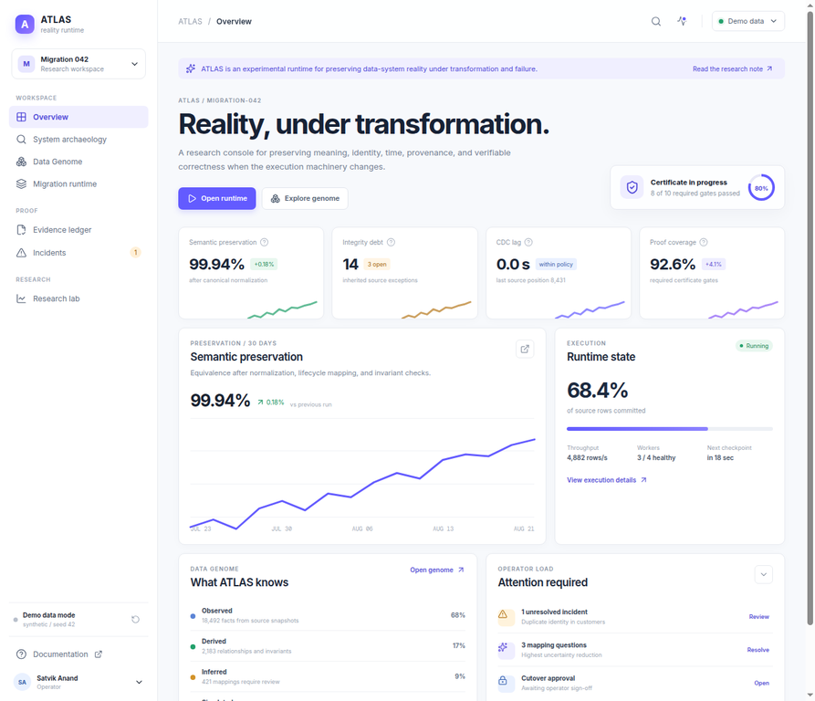

# ATLAS

## Experimental infrastructure runtime for data-system reality

ATLAS is a research-grade runtime for preserving and reasoning about data-system reality across **transformation, evolution, and failure**. A migration is the first reference application, not the product boundary.

> **If the database, schema, representation, transformation engine, or execution path changes, how can we demonstrate that everything that mattered was preserved?**

The core model is:

```text
STATE + MEANING + TIME + EVIDENCE + PROVENANCE + UNCERTAINTY
```

ATLAS deliberately distinguishes `OBSERVED`, `DERIVED`, `INFERRED`, `RECONSTRUCTED`, `PREDICTED`, `SIMULATED`, and `COUNTERFACTUAL` results. It is not presented as production-ready software. Live SQL Server integration, distributed queues/leases, provider-specific public-data connectors, and full release builds remain explicit extension boundaries.

## What is implemented

| Area | Reference implementation |
|---|---|
| Deterministic migration | Batch transforms, idempotent in-memory loading, checkpoints, quarantine, resumable execution |
| Schema intelligence | Profiling, PII/identifier heuristics, schema fingerprints, drift classification, relationship proposals with evidence |
| Transformations | Bounded AST-backed DSL: `TRIM`, `UPPER`, `PARSE_DATE`, `DECIMAL`, `MAP_ENUM`, `SPLIT_NAME`, `COALESCE`, and currency normalization |
| CDC | Typed `INSERT`/`UPDATE`/`DELETE` events, deduplication, ordering, gap detection, lag measurement, deterministic replay |
| Verification | Counts, aggregates, hashes, key coverage, duplicate detection, referential checks, financial invariants, distributions, samples, Merkle-style partition localization |
| Recovery | Durable JSONL checkpoints, explicit state machine, quarantine records, seeded chaos scenarios, audit hash chain |
| Governance | Risk factors, policy gates, RBAC permissions, approval-aware cutover orchestration, PII logging denial |
| Interfaces | Python CLI, OpenAPI-oriented ASP.NET Core control-plane scaffold, file and DB connector boundaries |
| Database evidence | SQL Server legacy/target schemas, indexes, stored procedure and reconciliation artifacts, isolation/deadlock lab scripts |
| Performance boundary | Rust fingerprint, semantic normalization, and hierarchical reconciliation kernels with a Python fallback |
| Data Genome | Entity, relationship, temporal, distribution, semantic-type, invariant, provenance, failure, dependency, and uncertainty model |
| System archaeology | Candidate identifiers, PII, temporal/monetary fields, implicit relationships, categorical states, and candidate rules with epistemic status |
| Epistemic evidence | Evidence ledger, knowledge decay, contradiction objects, assumption invalidation, and dependent-result blast radius |
| Semantic preservation | Byte-versus-semantic comparison, semantic fingerprints, semantic Merkle roots, and explainable semantic diff |
| Research runtime | Migration IR, shadow simulation, counterfactual removal, reconstruction candidates, public snapshot/time-capsule boundary, and as-of knowledge queries |
| Operator/research console | TypeScript/React console with Overview, Archaeology, Data Genome, Migration Runtime, Evidence, Incidents, and Research Lab views |

## Architecture

```text
                         +---------------------------+
                         | ASP.NET Core Control Plane |
                         | health / migrations / API  |
                         +-------------+-------------+
                                       |
                                       v
+-------------+       +---------------+----------------+
| CLI / Demo  +------>+ Deterministic Migration Engine |
+-------------+       | planner, transforms, checkpoints |
                      +------+------------------+-------+
                             |                  |
                 +-----------v----+     +-------v--------+
                 | Connectors     |     | Evidence Layer |
                 | SQL Server     |     | reconcile      |
                 | Postgres / CSV |     | CDC / replay   |
                 | JSON / SFTP    |     | audit / reports|
                 +-----------+----+     +-------+--------+
                             |                  |
                +------------v------------------v---------+
                | Source / Target / Event / Artifact State |
                | JSONL reference store; DB adapters optional|
                +------------------------------------------+

  Python reference engine      .NET control plane        Rust kernels       React console
 archaeology/genome/IR       orchestration/policy     semantic/Merkle     operator/research

```

The reference engine uses at-least-once CDC semantics, deterministic transformations, idempotent target writes, exact reconciliation checks, and append-only audit evidence. It does not claim exactly-once distributed delivery.

## Quick start

The minimal reference path requires Python 3.11 or newer.

```bash
python3 -m venv .venv
. .venv/bin/activate
pip install -e '.[test]'
python -m pytest
python -m apps.cli.atlas_cli demo --customers 25 --batch-size 10
```

The demo generates a seeded banking estate, profiles and transforms legacy-style records, executes resumable batches, persists checkpoints and audit entries, performs reconciliation, calculates a risk assessment, and prints machine-readable evidence. All generated state is placed under `.atlas/` and is safe to delete.

Useful commands:

```bash
python -m apps.cli.atlas_cli generate --seed 42 --customers 100 --output golden-datasets/generated
python -m apps.cli.atlas_cli inspect golden-datasets/generated
python -m apps.cli.atlas_cli profile golden-datasets/generated
python -m apps.cli.atlas_cli benchmark --rows 10000
python -m apps.cli.atlas_cli chaos worker-crash --seed 42
python -m apps.cli.atlas_cli chaos cdc-gap --seed 42
python -m apps.cli.atlas_cli archaeology golden-datasets/generated
python -m apps.cli.atlas_cli genome golden-datasets/generated
python -m apps.cli.atlas_cli compile --risk 0.7
python -m apps.cli.atlas_cli public-demo  # boundary report; no live API calls
cd apps/web-console && pnpm install && pnpm dev
```

The CLI entry point is also exposed as `atlas` when the project is installed with pip.

## Operator and research console

The TypeScript/React console is a demo-mode operator surface with separate views for the Overview, System Archaeology, Data Genome, Migration Runtime, Evidence Ledger, Incidents, and Research Lab. It uses a restrained **Stripe-inspired** visual system—light workspace, indigo proof states, thin borders, compact metrics, and high information density—without copying Stripe branding or hiding uncertainty.



See [`apps/web-console/README.md`](apps/web-console/README.md) for the UI run instructions and live-control-plane boundary.

## SQL Server reference environment

The primary enterprise reference is Microsoft SQL Server. The `sqlserver/` directory includes a deliberately inconsistent legacy schema, a normalized target schema, stored procedure patterns, reconciliation views, indexes, a deadlock lab, and transaction-isolation experiments. The SQL files are intentionally documented as reference artifacts; they have not been represented as a claim that a SQL Server instance is available in this build environment.

A future integration run should execute the scripts against SQL Server and add contract tests for the adapter. The Python engine remains usable without SQL Server.

## Correctness and evidence model

ATLAS separates a proposal from authorization. A schema relationship or mapping can be inferred with confidence and evidence, but the inference does not become a production constraint automatically. A high-risk cutover is blocked when reconciliation fails, CDC lag exceeds policy, a breaking schema change is present, raw PII logging is enabled, or approval is missing.

Every important action is designed to leave evidence:

```text
observation -> evidence -> inference -> decision -> validation -> audit record
```

The audit ledger is JSONL and hash-chained. Checkpoints include migration, job, table, batch, source position, CDC offset, target state, checksum, worker, and migration version. Quarantine records preserve the original and transformed context rather than silently dropping bad rows.

## Failure and recovery model

The reference engine supports deterministic failure injection for worker crashes, dropped events, duplicate events, schema changes, and corrupt batches. The implementation separates `PAUSED`, `RECOVERING`, `FAILED`, `ABORTED`, `ROLLED_BACK`, `VERIFIED`, and `COMPLETE`. A worker failure after a committed checkpoint can be resumed without duplicating committed target keys in the idempotent reference target.

This is a local reference model. Network partitions, SQL Server deadlock reproduction, distributed leases, queue backpressure, and multi-node scheduling require integration environments and are documented as next-stage work.

## Repository map

```text
atlas_core/                         Python reference domain engine
apps/cli/                           CLI and deterministic demo
apps/control-plane-dotnet/           ASP.NET Core control plane, services, policy, scheduler
apps/web-console/                    TypeScript/React operator and research console
crates/fingerprint/                  Rust fingerprint, semantic, and reconciliation kernels
sqlserver/                           T-SQL schema, procedures, views, labs
connectors/                          Adapter boundary directories
infrastructure/                      Compose and container assets
tests/                               Unit and invariant tests
docs/                                Technical design documents
adr/                                 Architecture decision records
chaos/                               Failure scenarios and runbooks
benchmarks/                          Reproducible benchmark harness
```

## Honest limitations

This repository does not claim production scale, zero downtime, exactly-once delivery, bank-grade security, or measured SQL Server throughput. The default demo is synthetic and local. The public-data command reports an explicit connector boundary and does not imply live SEC/GLEIF/ECB/FRED/Companies House ingestion. The React console is a polished demo-mode operator/research surface; the .NET service exposes production-shaped API boundaries but has not been compiled in this environment because the .NET SDK is absent. The Rust kernels have source and CI boundaries but have not been benchmarked here because the Rust toolchain is absent.

The project earns credibility by publishing those limitations. The next integration priorities are live SQL Server/PostgreSQL contract tests, distributed leases and queues, OpenTelemetry exporters, official provider connectors with immutable snapshots, and a deployed control-plane/console origin.

## License

Apache-2.0. See `LICENSE`.
